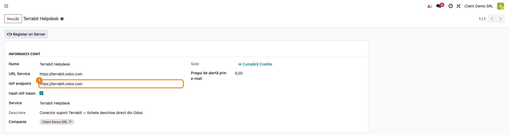
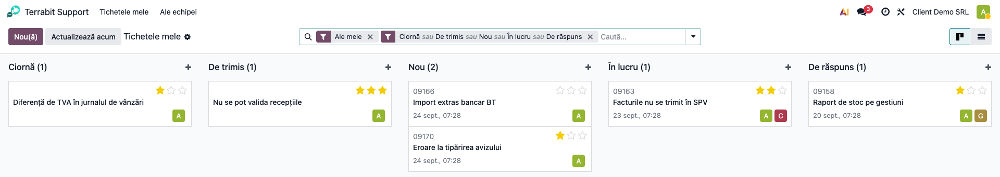
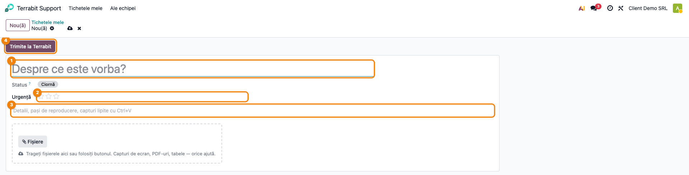
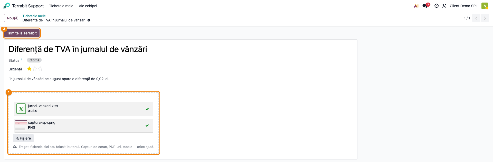
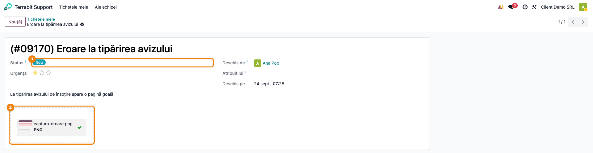
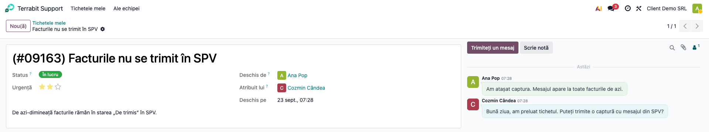
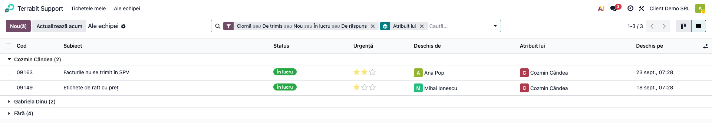
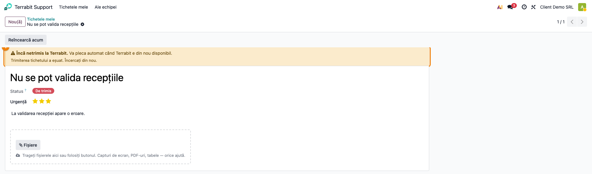

# Fișă Modul: Tichete de suport Terrabit direct din Odoo

**Modul:** `terrabit_helpdesk_connector`
**Utilizator principal:** orice utilizator intern al clientului care cere suport; administratorul Odoo pentru configurare
**Prioritate:** 🟡 Medie (canalul principal de suport pentru clienții cu contract, dar fără impact contabil)

---

## 1. Scop business

Clientul deschide, urmărește și discută tichetele de suport Terrabit fără să iasă din propriul Odoo:
fără email, fără portal separat, fără cont nou. Fiecare tichet se vede cu statusul real de la
Terrabit (nou, în lucru, așteaptă răspunsul clientului, închis), cu consultantul care se ocupă de
el și cu toată discuția. Colegii din aceeași firmă văd și tichetele celorlalți, așa că nu mai
deschid de două ori aceeași problemă.

Tichetul nu se pierde dacă Terrabit e în mentenanță: se salvează local și pleacă singur când
serverul revine.

## 2. Bază legală și context

Nu există temei legal: modulul nu generează documente fiscale și nici note contabile.

Context operațional:
- Tichetul trăiește la Terrabit. În baza clientului se păstrează o **oglindă doar pentru citire**
  (tichet, status, discuție, fișiere), reîmprospătată automat la 15 minute.
- Clientul scrie în două locuri: tichetul nou (subiect, urgență, descriere, fișiere) și răspunsurile
  din discuție. Restul câmpurilor le completează Terrabit.
- **Notele interne ale consultanților nu ajung niciodată la client.** Doar mesajele publice sunt
  oglindite.
- Conectorul nu trimite emailuri. Notificările pleacă o singură dată, din helpdesk-ul Terrabit,
  către urmăritorii tichetului, ca să nu primească nimeni același mesaj de două ori.

## 3. Utilizatori și roluri

| Rol | Ce face |
|---|---|
| Utilizator intern (grupul **Utilizator**) | deschide tichete, răspunde, vede tichetele proprii și ale colegilor |
| Administrator Odoo | verifică contul de conectare (endpoint, înregistrare) și e primul contactat când sincronizarea nu merge |

Nu există un grup separat: orice utilizator intern are acces. Un utilizator nu poate șterge tichete.
Oglinda se curăță singură când un tichet dispare de la Terrabit.

Roluri recomandate la testare:
- un utilizator intern **cu adresă de email** completată pe profil, care deschide tichetul;
- un al doilea utilizator intern, ca să verifici ecranul „Ale echipei";
- un consultant pe helpdesk-ul Terrabit de **test** (staging), care răspunde și schimbă statusul.

## 4. Conturi și date implicate

Nu sunt implicate conturi contabile.

Date necesare:
- **companie cu cod fiscal** completat: după el se leagă baza clientului de firma lui la Terrabit;
- **utilizatori cu email**: după email se recunoaște, la Terrabit, cine a scris tichetul;
- acces la internet spre helpdesk-ul Terrabit (`https://terrabit.odoo.com`).

Ce se trimite la Terrabit la înregistrarea contului: numele companiei, țara, codul fiscal, lista
modulelor instalate, identificatorul bazei și adresa ei. Merită spus clientului, la nevoie.

Fișierele: cele sub 2 MB se copiază la Terrabit. Cele mai mari rămân în baza clientului, iar
Terrabit primește doar un link cu token. Pentru ele, instanța clientului trebuie să fie accesibilă
din exterior (cazul oricărei instanțe odoo.sh).

## 5. Configurare inițială

1. Instalați modulul `terrabit_helpdesk_connector`. În meniul principal apare **Terrabit Support**.
2. Verificați că **fiecare companie are cod fiscal** (**Setări → Companii**). Fără el, contul nu se
   poate înregistra.
3. Verificați că utilizatorii care vor deschide tichete au **email** pe profil.
4. Opțional, verificați contul de conectare, creat automat la instalare, câte unul per companie.
   În modul dezvoltator, **Setări → Tehnic → IAP → Conturi IAP**, contul serviciului **Terrabit
   Helpdesk**, câmpul **IAP endpoint** trebuie să fie `https://terrabit.odoo.com`. Ecranul e tehnic,
   din modulul standard IAP, și are câteva etichete rămase în engleză („Register on Server", „Hash
   IAP token"). Nu trebuie introdus niciun cod
   de activare: contul se înregistrează singur (un cron zilnic reia înregistrarea dacă serverul era
   indisponibil).
5. Pe o **bază de test sau staging** a clientului: după neutralizare, endpointul trece automat pe
   `https://terrabit-staging.odoo.com`, iar cronurile conectorului se opresc. Sincronizarea se face
   atunci doar din butonul **Actualizează acum**. Vezi secțiunea 11.



## 6. Flux de utilizare

### Pasul 1 — Lista tichetelor

Accesați **Terrabit Support → Tichetele mele**. Tichetele apar grupate pe status, în ordinea în
care circulă un tichet: **Ciornă**, **De trimis**, **Nou**, **În lucru**, **De răspuns**, **Închis**. Apar doar
coloanele care au tichete. Implicit sunt afișate doar tichetele deschise; cele închise se pot afișa
cu filtrul **Închis**.

Pe fiecare card se văd codul (ex. `09163`), subiectul, urgența (stele), data deschiderii, cine l-a
deschis și avatarul consultantului Terrabit care se ocupă de tichet.



### Pasul 2 — Tichet nou

Apăsați **Nou**. În formular completați:
- **Subiect**: pe scurt, despre ce este vorba (obligatoriu);
- **Urgență**: implicit fără stea (*Scăzută*); stelele se adaugă doar când e cazul, până la
  *Blochează munca*;
- **Descriere**: detalii și pași de reproducere. Capturile de ecran se pot lipi direct cu Ctrl+V.

Tichetul nou e o **ciornă**. Odoo îl salvează singur pe parcurs, de exemplu când încărcați un
fișier sau treceți la alt ecran, dar **nu îl trimite**. Puteți reveni la el oricând, din coloana
**Ciornă**, până îl trimiteți la pasul 4.



### Pasul 3 — Atașarea fișierelor

Sub descriere e zona **Fișiere**: trageți fișierele cu mouse-ul în chenar, sau folosiți butonul
**Fișiere**. Fișierele apar imediat în listă și pot fi scoase cu ×.

Captura arată o ciornă cu fișierele atașate. Cât timp tichetul n-a plecat, fișierele se pot încă
adăuga sau scoate.



### Pasul 4 — Trimiterea tichetului

Când tichetul e complet, apăsați **Trimite la Terrabit**, în antetul formularului. Abia acum pleacă.
Titlul devine `(#09163) Subiect`, cu codul de la Terrabit, iar statusul trece în **Nou**.
Câmpurile completate de client se blochează, pentru că de aici tichetul îl continuă Terrabit.

**Găsește pe ecran:** statusul (colorat), **Deschis de**, **Deschis pe** și, sub descriere,
fișierele trimise. **Atribuit lui** rămâne gol până când un consultant Terrabit preia tichetul (vezi
pasul 5).

**Verifică:**
- titlul are codul între paranteze. Dacă lipsește, tichetul n-a plecat încă (vezi pasul 7);
- statusul nu e **De trimis**;
- fișierele atașate apar în zona de sub descriere.



### Pasul 5 — Discuția cu Terrabit

În chatter-ul tichetului apar răspunsurile consultanților, cu numele și avatarul lor, și mesajele
clientului. Clientul răspunde din **Trimiteți un mesaj**, ca pe orice document Odoo, inclusiv cu
fișiere atașate. Mesajul pleacă la Terrabit pe loc.

Când Terrabit îi cere clientului o informație, tichetul trece în **De răspuns**. E semnalul că
următorul pas e al clientului.

**Verifică:** apar doar mesajele publice. Notele interne ale consultanților nu apar niciodată aici.

În aceeași bară există și **Scrie notă**. O notă scrisă de client rămâne doar în baza lui: nu
pleacă la Terrabit. E utilă pentru comentarii între colegi, pe care consultantul nu trebuie să le
vadă.



### Pasul 6 — Tichetele echipei

Accesați **Terrabit Support → Ale echipei**. Apar toate tichetele firmei, indiferent cine le-a
deschis, inclusiv cele deschise direct la Terrabit (telefon, email). Se pot grupa după **Status**,
**Urgență**, **Deschis de** sau **Atribuit lui**. În gruparea după **Atribuit lui**, grupul **Fără**
cuprinde tichetele pe care încă nu le-a preluat niciun consultant.



### Pasul 7 — Când Terrabit e indisponibil

Dacă serverul Terrabit nu răspunde la **Trimite la Terrabit** (mentenanță, rețea), tichetul **nu se
pierde**: rămâne în coloana **De trimis**. Deschis, tichetul arată sus un avertisment cu motivul
(„Încă netrimis la Terrabit…"). Cronul îl retrimite automat (la 15
minute), cu tot cu fișiere și în numele celui care l-a scris, iar la retrimitere nu se creează un
al doilea tichet. Se poate grăbi din butonul **Reîncearcă acum** de pe tichet, sau din
**Actualizează acum**, din antetul listei, după care lista se reîncarcă singură. O **ciornă** nu
pleacă niciodată singură, nici din coadă: doar la apăsarea butonului.

La fel se întâmplă cu un răspuns scris în discuție cât timp serverul e indisponibil: rămâne
salvat, iar la retrimitere pleacă tot cu fișierele lui. Utilizatorul vede pe loc notificarea
„Răspunsul n-a plecat încă", ca să nu creadă că mesajul a ajuns.



### Note de monografie și raportare

Nu se aplică: modulul nu generează note contabile și nici raportări.

## 7. Legături cu alte module / declarații

| Modul | Rol |
|---|---|
| `terrabit_iap` | contul de conectare și înregistrarea automată pe serverul Terrabit |
| `iap` | modelul standard de cont IAP |
| `mail` | discuția (chatter), urmăritorii, atașamentele |
| `terrabit_iap_server_helpdesk` *(la Terrabit, nu la client)* | partea de server: primește tichetele, trimite statusul și mesajele |

**Ce e automat:** înregistrarea contului, trimiterea tichetului și a răspunsurilor, reîmprospătarea
statusului, a consultantului și a discuției (la 15 minute), retrimiterea din coadă, curățarea
tichetelor retrase la Terrabit, trecerea pe serverul de test după neutralizare.

**Ce rămâne manual:** completarea codului fiscal al companiei și a emailului utilizatorilor;
alegerea urgenței. Pe staging, sincronizarea se face din **Actualizează acum**.

## 8. Verificări pentru consultant

- [ ] Meniul **Terrabit Support** apare după instalare, cu **Tichetele mele** și **Ale echipei**.
- [ ] Contul IAP „Terrabit Helpdesk" există pentru fiecare companie și are endpoint-ul
      `https://terrabit.odoo.com` (pe staging: `https://terrabit-staging.odoo.com`).
- [ ] Un tichet nou pornește fără stea la urgență.
- [ ] Un tichet nou, salvat dar netrimis, rămâne **Ciornă** și **nu** apare la Terrabit.
- [ ] După **Trimite la Terrabit**, titlul primește codul Terrabit, iar statusul e **Nou**.
- [ ] Tichetul apare la Terrabit pe echipa corectă, pe firma clientului.
- [ ] Un fișier tras în zonă ajunge la Terrabit. Unul peste 2 MB apare ca link în descriere și se
      deschide din exterior.
- [ ] O schimbare de status la Terrabit (ex. „Așteaptă răspuns") apare la client după
      **Actualizează acum**.
- [ ] Un răspuns public al consultantului apare în chatter, cu numele lui. O notă internă **nu**
      apare.
- [ ] O notă scrisă de client cu **Scrie notă** **nu** ajunge la Terrabit.
- [ ] Un răspuns scris cu Terrabit oprit afișează „Răspunsul n-a plecat încă" și pleacă după
      revenire, cu fișierele lui.
- [ ] Un tichet deschis de alt coleg apare în **Ale echipei**, dar nu în **Tichetele mele**.
- [ ] Cu serverul Terrabit oprit, tichetul rămâne **De trimis** și pleacă după revenire, **o singură
      dată**.

## 9. Mesaje de eroare frecvente

| Mesaj | Cauză | Remediere |
|---|---|---|
| „Please set a VAT number for company …" | compania n-are cod fiscal, deci contul nu se poate înregistra | completați codul fiscal în **Setări → Companii** |
| „Contul dumneavoastră Odoo nu are email completat…" | utilizatorul curent n-are email pe profil | completați emailul utilizatorului |
| „Scrieți pe scurt despre ce este vorba." | subiectul e gol | completați **Subiect** |
| avertismentul „Încă netrimis la Terrabit" (ex.: „Trimiterea tichetului a eșuat. Încercați din nou.") | serverul Terrabit n-a răspuns la timp | nimic: tichetul rămâne **De trimis** și pleacă automat. Dacă persistă ore în șir, verificați endpoint-ul contului IAP |
| „Account not found or not linked to a company" | contul nu e încă înregistrat la Terrabit | așteptați înregistrarea automată sau verificați codul fiscal al companiei |
| notificarea „Răspunsul n-a plecat încă" | serverul n-a primit răspunsul din discuție, **sau** utilizatorul n-are email pe profil | dacă Terrabit era indisponibil: nimic, mesajul rămâne salvat și e retrimis automat, cu tot cu fișiere. Dacă lipsește emailul: completați-l pe profilul utilizatorului, altfel retrimiterea eșuează din nou |

## 10. Capturi de ecran

Capturile se generează automat din `tests/test_screenshots.py` (mixinul `ScreenshotCase` din
`l10n_ro_doc_screenshots`, import defensiv), în limba română. Ordinea e cea a pașilor de mai sus:

1. `01_cont_conectare.png` — contul IAP „Terrabit Helpdesk", cu endpoint-ul.
2. `02_tichetele_mele.png` — kanbanul „Tichetele mele", grupat pe status.
3. `03_tichet_nou.png` — formularul de tichet nou, gol, cu câmpurile de completat evidențiate și butonul **Trimite la Terrabit**.
4. `04_zona_fisiere.png` — o ciornă cu fișiere atașate, înainte de trimitere.
5. `05_tichet_trimis.png` — tichetul abia trimis: `(#cod)`, status **Nou**, fișierele plecate.
6. `06_discutie.png` — chatter-ul, cu răspunsul consultantului și al clientului.
7. `07_ale_echipei.png` — lista „Ale echipei", grupată după consultant, cu un grup deschis.
8. `08_de_trimis.png` — tichet în coada „De trimis", cu motivul afișat.

Regenerare:

```bash
./odoo/odoo-bin -c odoo.conf -d <db> -i terrabit_helpdesk_connector,l10n_ro_doc_screenshots \
    --test-tags=fise_screenshots --stop-after-init
```

## 11. Observații pentru manual

- **Terrabit rămâne sursa adevărului.** Tot ce vede clientul e o oglindă; o modificare făcută la
  Terrabit apare la client la următoarea sincronizare (maxim 15 minute sau imediat, din
  **Actualizează acum**).
- **Staging-ul clientului nu vorbește cu producția Terrabit.** Pe o bază neutralizată, conectorul
  trece singur pe helpdesk-ul de test, iar cronurile sale se opresc. Asta rămâne valabil și dacă
  modulul se instalează sau se actualizează după neutralizare. Testele făcute acolo nu ajung la
  consultanți.
- **Un tichet închis și apoi șters la Terrabit rămâne vizibil la client**, cu filtrul **Închis**:
  conectorul nu mai întreabă serverul de tichetele închise. E o limită cunoscută, fără impact
  asupra lucrului curent.
- **Fișierele peste 2 MB** depind de accesibilitatea instanței clientului. La o instalare internă,
  fără domeniu public, Terrabit nu le poate deschide. Recomandați atunci atașarea unor fișiere mai
  mici sau arhivarea lor.
- Notificarea de la **Actualizează acum** apare în engleză („Synced"): textul e scris direct în
  acțiune și nu intră în traduceri.
