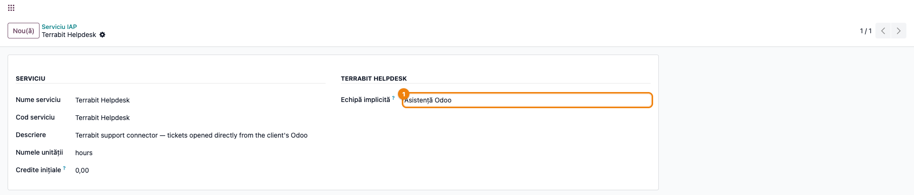
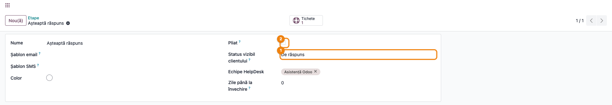
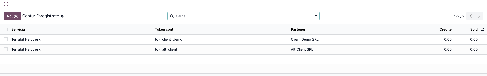
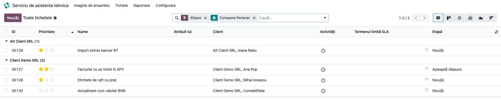
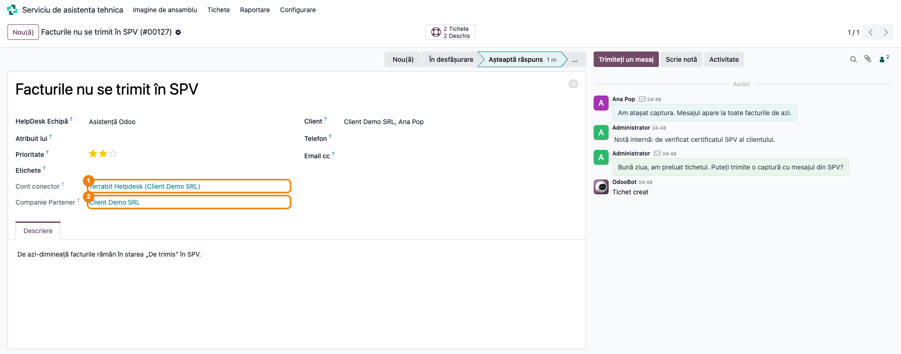

# Fișă Modul: Primirea tichetelor din Odoo-ul clienților

**Modul:** `terrabit_iap_server_helpdesk`
**Utilizator principal:** consultanții Terrabit, care tratează tichetele; administratorul helpdesk-ului Terrabit, pentru configurare
**Prioritate:** 🟡 Medie (canalul prin care clienții cu conector deschid tichete, fără impact contabil)

---

## 1. Scop business

Modulul e partea de server a conectorului de suport. Rulează **doar pe helpdesk-ul Terrabit** și
primește tichetele pe care clienții le deschid din propriul Odoo, cu modulul
`terrabit_helpdesk_connector`. Pentru consultant, un astfel de tichet e un tichet obișnuit de
helpdesk: îl preia, îi răspunde, îl mută între stadii și îl închide ca pe oricare altul. Modulul
se ocupă de restul: leagă tichetul de firma clientului și îl pune pe echipa potrivită. Statusul,
consultantul atribuit și discuția publică ajung la client la următoarea sincronizare a conectorului
lui: conectorul le cere, serverul nu le trimite din proprie inițiativă.

## 2. Bază legală și context

Nu există temei legal: modulul nu generează documente fiscale și nici note contabile.

Context operațional:
- Fiecare client cu conector are un **cont înregistrat** pe serviciul **Terrabit Helpdesk**. Contul
  se creează singur la prima conectare și se leagă de partenerul-companie al clientului, după
  **codul fiscal**.
- Potrivirea codului fiscal e **tolerantă** la felul în care e scris: „RO16507426",
  „ro 16507426" și „16507426" găsesc același partener. Serverul caută doar printre partenerii
  **companie activi**. Dacă nu găsește niciunul, creează un partener nou. Dacă găsește mai mulți
  (dubluri rămase din trecut), alege partenerul legat de cele mai multe conturi, iar la egalitate
  pe cel mai vechi. Modulul `terrabit_iap_server` face asta începând cu 19.0.0.1.3. Înainte
  potrivirea era exactă, pe text, și crea dubluri fără niciun avertisment.
- Clientul vede statusul tichetului simplificat, în patru stări: **Nou**, **În lucru**,
  **De răspuns**, **Închis**. Fiecare stadiu al helpdesk-ului nostru e tradus într-una dintre ele.
- **Clientul vede doar mesajele publice.** Notele interne ale consultanților nu pleacă niciodată la
  client.
- Nu se trimit emailuri în plus: notificările sunt cele obișnuite ale helpdesk-ului, către urmăritorii
  tichetului.

## 3. Utilizatori și roluri

| Rol | Ce face |
|---|---|
| Consultant Terrabit | tratează tichetele venite prin conector, ca pe orice tichet |
| Administrator helpdesk | alege echipa implicită, stabilește ce vede clientul pentru fiecare stadiu, urmărește conturile înregistrate |

Ecranele de configurare cer modul dezvoltator: cele din **Setări → Tehnic**, dar și meniul
**Configurare → Etape** al helpdesk-ului.

Roluri recomandate la testare:
- un administrator pe helpdesk-ul Terrabit de **test** (staging), niciodată pe producție;
- un client de test cu conectorul instalat și cu staging-ul lui neutralizat, ca să trimită tichete.

## 4. Conturi și date implicate

Nu sunt implicate conturi contabile.

Date necesare:
- **partenerul-companie al clientului, cu cod fiscal**: după el se leagă contul;
- o **echipă de helpdesk** pentru tichetele venite prin conector;
- stadiile helpdesk-ului, fiecare cu statusul pe care îl vede clientul.

Contul fiecărui client are și un **sold de credite**. Consumul automat al creditelor din orele
pontate nu e încă implementat, deci deocamdată soldul nu scade singur.

## 5. Configurare inițială

1. Instalați modulul `terrabit_iap_server_helpdesk` pe helpdesk-ul Terrabit. Serviciul **Terrabit
   Helpdesk** se creează automat.
2. În modul dezvoltator, **Setări → Tehnic → IAP → Serviciu IAP → Terrabit Helpdesk**, completați
   **Echipă implicită**. Fără ea, tichetul primește echipa implicită standard a helpdesk-ului, care
   poate fi alta decât cea de suport.

   

3. Verificați ce vede clientul pentru fiecare stadiu (vezi pasul 1 din flux). **Doar la instalare**,
   modulul propune singur o mapare: etapele care conțin în nume „răspuns" / „raspuns", „response",
   „await" sau „feedback" devin **De răspuns**; prima etapă deschisă, cea cu secvența cea mai mică,
   devine **Nou**, dacă nu e deja **De răspuns**; restul, **În lucru**.
   **O etapă creată după instalare pornește pe În lucru**, oricum s-ar numi. Setați-i manual
   **Status vizibil clientului**.
   Etapele cu bifa **Pliat** apar la client ca **Închis**, indiferent de mapare.

## 6. Flux de utilizare

### Pasul 1 — Ce vede clientul pentru fiecare stadiu

În modul dezvoltator, accesați **Serviciu de asistenta tehnica → Configurare → Etape** și
deschideți o etapă. Câmpul **Status vizibil
clientului** arată cum apare stadiul în Odoo-ul clientului: **Nou**, **În lucru** sau
**De răspuns**.

**Găsește pe ecran:** câmpul **Status vizibil clientului** și bifa **Pliat**.

**Verifică:**
- stadiul în care îi cereți clientului o informație e pe **De răspuns**. E semnalul, la client, că
  urmează pasul lui;
- etapele de închidere (la noi: Solved, Cancelled, Closed M/A/T) au bifa **Pliat**, ca să apară la
  client ca **Închis**.



### Pasul 2 — Conturile clienților

Accesați **Setări → Tehnic → IAP → Conturi înregistrate**. Fiecare client cu conector are aici un
cont pe serviciul **Terrabit Helpdesk**, legat de partenerul lui.

**Găsește pe ecran:** coloana cu partenerul și serviciul.

**Verifică:** partenerul e firma clientului, nu o persoană de contact. Un cont fără partener nu
poate deschide tichete. Contul apare în listă abia după ce clientul își înregistrează conectorul.
Până atunci e inactiv și se vede doar cu filtrul **Arhivat**.



### Pasul 3 — Tichetele venite prin conector

Accesați **Serviciu de asistenta tehnica → Tichete → Toate tichetele** și grupați după
**Companie Partener**. Tichetele fiecărei firme stau
împreună, indiferent ce contact le-a deschis. Tot aici apar și tichetele aceleiași firme deschise
direct la noi, prin telefon sau email.

**Găsește pe ecran:** grupurile pe firmă și, în fiecare, tichetele cu clientul (firma și contactul)
și coloana **Etapă**.

**Verifică:** fiecare tichet e sub firma lui, inclusiv cele deschise de alți colegi ai clientului.



### Pasul 4 — Tratarea tichetului

Deschideți tichetul. Se lucrează ca pe orice tichet: preluare, stadiu, pontaj, răspuns.
- Răspunsurile scrise cu **Trimiteți un mesaj** ajung la client. Notele scrise cu **Scrie notă**
  rămân interne. Un mesaj trimis și marcat ulterior „doar pentru angajați" dispare de la client la
  următoarea sincronizare.
- Mesajele clientului apar în chatter în numele celui care le-a scris, ca un contact al firmei
  lui.
- **HelpDesk Echipă** e echipa implicită aleasă la configurare.
- În modul dezvoltator, formularul arată și **Cont conector** și **Companie Partener**.



### Note de monografie și raportare

Nu se aplică: modulul nu generează note contabile și nici raportări.

## 7. Legături cu alte module / declarații

| Modul | Rol |
|---|---|
| `terrabit_iap_server` | conturile înregistrate, serviciile și creditele IAP ale clienților |
| `helpdesk` | tichetele, echipele, stadiile |
| `helpdesk_timesheet` | pontajul pe tichete. E dependență și pentru că una dintre vederile extinse de modul conține câmpul de proiect |
| `terrabit_helpdesk_connector` *(la client, nu la Terrabit)* | ecranele din Odoo-ul clientului |

**Ce e automat:** crearea și legarea contului clientului, atribuirea echipei implicite, legarea
tichetului de firma clientului. Statusul, consultantul atribuit și mesajele publice ajung la client la
următoarea sincronizare a conectorului. Dacă aceeași cerere ajunge de două ori (după un timeout la client), serverul
întoarce același tichet, nu creează unul nou. Asta funcționează când conectorul trimite cheia
cererii, lucru pe care îl fac versiunile curente.

**Ce rămâne manual:** alegerea echipei implicite, maparea stadiilor, completarea codului fiscal pe
partenerul clientului, alocarea creditelor.

## 8. Verificări pentru consultant

- [ ] Serviciul **Terrabit Helpdesk** are **Echipă implicită** completată.
- [ ] Fiecare etapă deschisă are un **Status vizibil clientului** potrivit. Etapa de așteptare a
      clientului e pe **De răspuns**. Verificați la fiecare etapă nouă: pornește pe **În lucru**.
- [ ] Etapele de închidere au bifa **Pliat**.
- [ ] Dacă vrem ca clienții să-și închidă singuri tichetele, echipa are bifa **Closure by Customers**
  (tichetul trece în prima etapă pliată, cu notă internă „Tichet închis de client”; pontajul de 0 h
  se pune automat).
- [ ] Contul unui client nou apare în **Conturi înregistrate** după ce își înregistrează
      conectorul, legat de firma lui, nu de un partener dublură.
- [ ] Un tichet trimis din conector ajunge pe echipa implicită, cu **Companie Partener** completată.
- [ ] Un răspuns cu **Trimiteți un mesaj** apare la client. O notă cu **Scrie notă** nu apare.
- [ ] La mutarea tichetului în stadiul de așteptare, clientul vede **De răspuns** după următoarea
      sincronizare.
- [ ] Testele se fac pe helpdesk-ul de **staging**, nu pe producție.

## 9. Mesaje de eroare frecvente

Mesajele de mai jos le vede clientul în Odoo-ul lui, nu consultantul. Le primim când ne sună.

| Mesaj | Cauză | Remediere |
|---|---|---|
| „Account not found or not linked to a company" | contul clientului nu e încă înregistrat sau nu e legat de firma clientului | verificați contul în **Conturi înregistrate** (inclusiv cu filtrul **Arhivat**) |
| „Missing required parameters: …" | din cererea clientului lipsește subiectul, emailul utilizatorului sau textul răspunsului | la client: completați emailul pe profilul utilizatorului și subiectul tichetului |
| „Ticket not found for this company." | clientul răspunde pe un tichet care nu mai e al firmei lui (mutat pe alt partener, arhivat) | verificați **Companie Partener** pe tichet |
| „The message is empty." | răspuns format doar din spații | nimic de făcut la noi |

Separat, nu ca eroare: dacă tichetele unei firme apar împărțite în două grupuri în **Companie
Partener**, e aproape sigur un partener dublură. Poate fi rămas din perioada de dinainte de potrivirea
tolerantă. Se mai creează unul nou și dacă partenerul firmei e arhivat sau nu e marcat ca companie
(vezi secțiunea 2). Unificați partenerii. Conturile noi ajung oricum pe cel cu cele mai multe
conturi.

## 10. Capturi de ecran

Capturile se generează automat din `tests/test_screenshots.py` (mixinul `ScreenshotCase` din
`l10n_ro_doc_screenshots`, import defensiv), în limba română. Ordinea e cea a pașilor de mai sus:

1. `01_serviciu.png` — serviciul „Terrabit Helpdesk", cu echipa implicită.
2. `02_stadiu.png` — formularul unui stadiu, cu statusul vizibil clientului.
3. `03_conturi.png` — conturile înregistrate ale clienților.
4. `04_tichete_pe_firma.png` — tichetele grupate după **Companie Partener**.
5. `05_tichet.png` — un tichet venit prin conector, cu discuția.

Regenerare:

```bash
./odoo/odoo-bin -c odoo.conf -d <db> -i terrabit_iap_server_helpdesk,l10n_ro_doc_screenshots \
    --test-tags=fise_screenshots --stop-after-init
```

## 11. Observații pentru manual

- **Modulul nu se instalează la clienți.** La client se instalează doar `terrabit_helpdesk_connector`.
- **Maparea stadiilor e o decizie de comunicare, nu tehnică.** Un stadiu intern ca „In Pending",
  lăsat pe **În lucru**, îi spune clientului că lucrăm, deși de fapt așteptăm pe altcineva. Merită
  revizuită periodic.
- **Închiderea unui tichet cere pontaj** pe helpdesk-ul Terrabit. Regula vine din alt modul, nu din
  acesta, dar fără pontaj tichetul nu trece în stadiul închis și clientul nu îl vede **Închis**.
- **Creditele** există pe cont, dar consumul lor din orele pontate e încă doar planificat.
