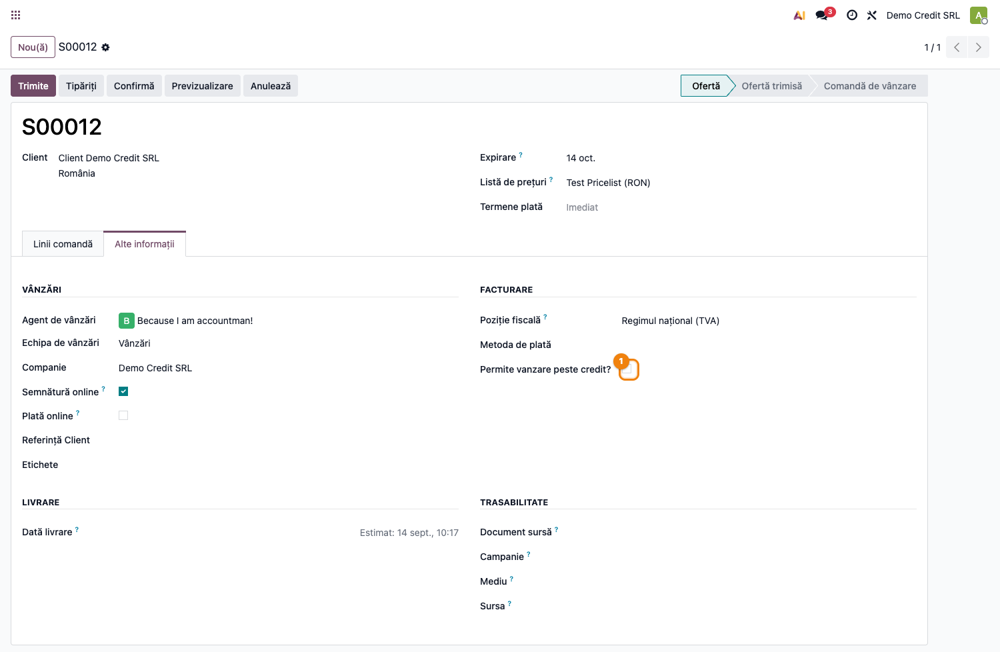

# Fișă Modul: Control limită de credit pentru parteneri

**Modul:** `terrabit_partner_credit_limit`
**Utilizator principal:** Contabil clienți, Manager vânzări, Operator comercial
**Prioritate:** 🟡 Medie (control de risc financiar, nu obligație legală)

---

## 1. Scop business

Această fișă descrie utilizarea modulului `terrabit_partner_credit_limit` pentru scenariul
**Control limită de credit pentru parteneri**. Modulul blochează confirmarea comenzilor de vânzare
atunci când soldul de încasat al clientului (facturi neîncasate, opțional și cele restante) ar
depăși limita de credit stabilită pe partener, cu posibilitatea de derogare controlată prin roluri
și de excepții pe echipă de vânzări sau pe partener. Consultantul folosește documentul pentru
reproducerea fluxului în baza demo.

## 2. Bază legală și context

Nu există o obligație legală specifică — este un control intern de gestiune a riscului de credit
comercial. Contextul operațional: firma acordă termene de plată clienților și dorește să limiteze
expunerea față de un client la o valoare maximă (limita de credit), eventual cu o marjă de toleranță
și cu o perioadă de grație (`clemency_days`) înainte ca o factură scadentă să fie considerată
restantă.

## 3. Utilizatori și roluri

Contabil clienți, Manager vânzări, Operator comercial (întocmește comenzi).

Roluri specifice introduse de modul:
- **Manage credit limits** (`group_credit_limit`) — poate modifica limita de credit, marcajul
  „Allow Over Credit?" și zilele de clemență de pe partener. **Nu** ocolește blocajul la confirmarea
  comenzii — dimpotrivă, cui are acest grup i se ascunde și butonul „Req. confirm" (vezi Pasul 4/5).
- **Can approve sale order over credit limit** (`group_credit_limit_sale_order`) — singurul grup
  care ocolește verificarea la confirmare (`action_confirm`) și care poate bifa „Allow Over Credit?"
  direct pe comanda de vânzare, pentru a trece peste blocaj.

> Atenție la testare: un utilizator cu **doar** „Manage credit limits" (fără „Can approve…") rămâne
> blocat la confirmarea unei comenzi peste limită și nu vede nici butonul „Req. confirm" — pentru
> deblocare are nevoie explicit de grupul „Can approve sale order over credit limit".

Roluri recomandate pentru testare:
- Administrator funcțional: instalează modulul și configurează parametrii globali.
- Operator comercial (fără grupurile de mai sus): creează comenzi și observă blocajul.
- Contabil/manager cu grupul „Manage credit limits": ajustează limita și aprobă depășirile.

## 4. Conturi și date implicate

Modulul nu introduce conturi noi — folosește soldul de încasat calculat de Odoo (`credit` pe
`res.partner`, alimentat din facturile de client `out_invoice`/`out_refund` postate și
neîncasate) sau, opțional, direct din facturi (`account.move`) dacă parametrul
`credit_limit_from_invoices` este activat.

Date minime pentru demo:
- companie cu localizare contabilă instalată și jurnal de vânzări funcțional;
- un partener de test cu `credit_limit` setat (ex. 100);
- cel puțin o factură de client postată și neîncasată pe acel partener, pentru a genera sold;
- o echipă de vânzări (`crm.team`) de test.

## 5. Configurare inițială

1. Instalați modulul `terrabit_partner_credit_limit` pe baza demo (depinde de `account_payment`,
   `sale_management` și `terrabit_partner_payable_receivable`).
2. Verificați elementele nou apărute: câmpurile de limită de credit pe formularul partenerului și
   blocul „Limită de credit" din **Vânzări → Configurare → Setări**.
3. Setați parametrii globali din Setări: toleranța, telefonul departamentului contabil și dacă
   termenele imediate sar peste verificare (implicit **activ** — vine setat `True` din
   `data/ir.config_parameter.xml` la instalare, deși câmpul din formular are default `False`).
4. Configurați `credit_limit` pe partenerul de test și, dacă e cazul, bifați „Ignore credit limits"
   pe echipa de vânzări folosită la testare.
5. Verificați că utilizatorul de test are/nu are grupurile „Manage credit limits" și „Can approve
   sale order over credit limit", după scenariul urmărit.

## 6. Flux de utilizare

### Pasul 1 — Setarea limitei de credit pe partener

Accesați **Contacte → deschideți partenerul → tab Vânzări & Achiziții**, secțiunea
**Informație fiscală**, și completați **Limită de credit**. Câmpurile **Permite vânzare peste
credit?** (`Allow Over Credit?`, ignoră permanent limita pentru acest partener) și **Zile de grație**
(`Clemency Days`, zile înainte ca o factură scadentă să conteze ca restantă) sunt editabile doar de
utilizatorii din grupul „Manage credit limits" — pentru ceilalți apar needitabile (`readonly`).


### Pasul 2 — Parametrii globali de verificare

Accesați **Vânzări → Configurare → Setări**, secțiunea **Credit Limit**: toleranța admisă
(`credit_limit.tolerance`, implicit 1), telefonul departamentului contabil afișat în mesajul de
eroare, opțiunea de a sări verificarea pentru termene de plată imediate
(`credit_limit.skip_term_immediate`) și opțiunea de a calcula soldul din facturi neplătite în loc
de soldul de încasat contabil (`credit_limit_from_invoices`).


> Dacă `credit_limit_from_invoices` este activat, un al doilea parametru,
> `credit_limit_check_supplier_invoices`, decide dacă se iau în calcul și facturile de furnizor
> (compensare) sau doar cele de client — acest al doilea parametru nu are câmp dedicat în Setări și
> se editează din **Tehnic → Parametri → Parametri de sistem**.

### Pasul 3 — Excepție pe echipă de vânzări

Accesați **Vânzări → Configurare → Echipe de vânzări → deschideți o echipă** și bifați
**Ignore credit limits** dacă acea echipă (ex. retail cu plată la livrare) nu trebuie supusă
verificării.


### Pasul 4 — Blocarea comenzii care depășește limita

Creați o comandă de vânzare pentru partenerul de test, cu o valoare care, adunată la soldul curent,
depășește limita de credit plus toleranța. La **Confirmă**, dacă utilizatorul nu are grupul
„Can approve sale order over credit limit" și comanda nu are bifat „Allow Over Credit?", confirmarea
este blocată cu un mesaj de eroare (**„Limita credit atinsă"**, tradus în RO) care arată soldul de
încasat, valoarea comenzii curente și limita de credit.


### Pasul 5 — Derogare controlată

Pe formularul comenzii, tabul **Alte informații**, utilizatorii din grupul „Can approve sale order
over credit limit" văd câmpul **Allow Over Credit?** — bifarea lui permite confirmarea comenzii
peste limită. Utilizatorii care **nu** au grupul „Manage credit limits" (indiferent dacă au sau nu
„Can approve…") văd în schimb butonul **Req. confirm** în antet — vizibil doar pe ofertă/ofertă
trimisă, când verificarea semnalează depășire sau facturi restante — care deschide un wizard de
activitate (`mail.activity`) adresat responsabilului echipei de vânzări, cerându-i să aprobe
depășirea.



### Note de monografie și raportare

Modulul nu generează note contabile proprii — se bazează pe soldul standard `res.partner.credit`
(sau pe facturile `account.move` neplătite, dacă `credit_limit_from_invoices` e activ) și doar
condiționează **confirmarea comenzii de vânzare** (`sale.order.action_confirm`), fără a atinge
înregistrările contabile ale facturilor.

## 7. Legături cu alte module / declarații

| Modul / proces | Rol în flux | Tip legătură |
|---|---|---|
| `account_payment` | soldul de încasat al partenerului, stare plăți | dependență (manifest) |
| `sale_management` | comanda de vânzare și fluxul de confirmare | dependență (manifest) |
| `terrabit_partner_payable_receivable` | secțiunea de sold client/furnizor pe formularul comenzii, unde apare avertizarea de depășire | dependență (manifest) |
| `crm_team` (`sales_team`) | excepția „Ignore credit limits" pe echipă | extindere |
| `mail` (`mail.activity`) | activitatea de solicitare de aprobare (**Req. confirm**) | integrare |

> Notă: modulul suprascrie și `mail.activity._default_activity_type_for_model`, la nivel global
> (pentru toate modelele, nu doar `sale.order`) — dacă există un tip de activitate implicit definit
> pentru modelul respectiv, acela e folosit în locul celui standard.

Ce este automat: blocarea confirmării comenzii, calculul soldului, afișarea avertizării de
depășire, precompletarea activității de aprobare către responsabilul echipei.
Ce rămâne manual: decizia de a bifa „Allow Over Credit?" sau de a acorda grupurile de derogare,
stabilirea limitei de credit per partener și a parametrilor globali.

## 8. Verificări pentru consultant

- [ ] Modulul se instalează fără erori pe baza demo (dependențe: `account_payment`,
      `sale_management`, `terrabit_partner_payable_receivable`).
- [ ] Câmpurile de limită de credit de pe partener sunt needitabile pentru un utilizator fără
      grupul „Manage credit limits" și editabile pentru unul cu acest grup.
- [ ] O comandă de vânzare care depășește limita + toleranța este blocată la confirmare, cu mesaj
      clar (sold, valoare comandă, limită).
- [ ] Bifarea „Ignore credit limits" pe echipa de vânzări permite confirmarea fără verificare.
- [ ] Bifarea „Allow Over Credit?" pe partener sau pe comandă (cu grupul potrivit) permite
      confirmarea peste limită.
- [ ] Butonul „Req. confirm" apare doar pentru utilizatorii fără grupul de aprobare și deschide
      corect activitatea către responsabilul echipei de vânzări.
- [ ] Parametrii din Setări (toleranță, telefon contabilitate, termen imediat, calcul din facturi)
      se salvează și influențează verificarea așa cum este descris.

## 9. Mesaje de eroare frecvente

| Mesaj / simptom | Cauză probabilă | Remediere |
|-----------------|-----------------|-----------|
| „Limita credit atinsă. De încasat: … Comanda curentă: … Limita credit: …" (EN: „Cannot confirm order. To receive: … Current order: … Credit limit: …") | Soldul + valoarea comenzii depășesc limita de credit + toleranța | Bifați „Allow Over Credit?" (dacă utilizatorul are dreptul), măriți limita de credit, sau folosiți fluxul „Req. confirm" |
| „There are overdue invoices: …" | Există facturi scadente (peste zilele de clemență) neîncasate pe acest partener | Încasați/regularizați facturile restante sau bifați „Allow Over Credit?" pe partener |
| Câmpul „Limită de credit" apare needitabil pe partener | Utilizatorul curent nu are grupul „Manage credit limits" | Adăugați utilizatorul în grupul „Manage credit limits" |
| Câmpul „Allow Over Credit?" nu apare pe comanda de vânzare | Utilizatorul nu are grupul „Can approve sale order over credit limit" | Adăugați utilizatorul în grupul respectiv sau folosiți butonul „Req. confirm" |
| Verificarea nu ține cont de o comandă plătită cu cardul la confirmare | Parametrul `terrabit_partner_credit_limit.skip_only_card` limitează sărirea verificării doar la tranzacții altfel decât transfer bancar/ramburs | Verificați valoarea parametrului de sistem `terrabit_partner_credit_limit.skip_only_card` |

## 10. Capturi de ecran

Capturile (`readme/screenshots/`) sunt generate din `tests/test_screenshots.py`, în limba română:

1. `01_partner_credit_limit.png` — formularul partenerului cu limita de credit, Allow Over Credit
   și Clemency Days.
2. `02_settings_credit_limit.png` — setările globale de limită de credit din
   Vânzări → Configurare → Setări.
3. `03_sale_team_ignore.png` — echipa de vânzări cu opțiunea „Ignore credit limits".
4. `04_sale_order_blocked.png` — mesajul de eroare la confirmarea comenzii peste limita de credit.
5. `05_sale_order_allow_overcredit.png` — comanda cu bifa „Allow Over Credit?" și butonul
   „Req. confirm".

Regenerare (test Playwright, `tests/test_screenshots.py`):

```bash
./odoo/odoo-bin -c odoo.conf -d <db> -u terrabit_partner_credit_limit,l10n_ro_doc_screenshots \
    --test-tags=fise_screenshots --stop-after-init
```

## 11. Observații pentru manual

În manualul final, păstrați explicația orientată pe activitatea utilizatorului: modulul nu
generează note contabile, ci doar condiționează confirmarea comenzii de vânzare pe baza soldului
de încasat al clientului. Insistați pe distincția dintre cele două grupuri de acces (administrare
limită vs. aprobare depășire pe comandă) și pe rolul echipei de vânzări ca excepție rapidă pentru
canale care nu au risc de credit (ex. plată la livrare/card).
