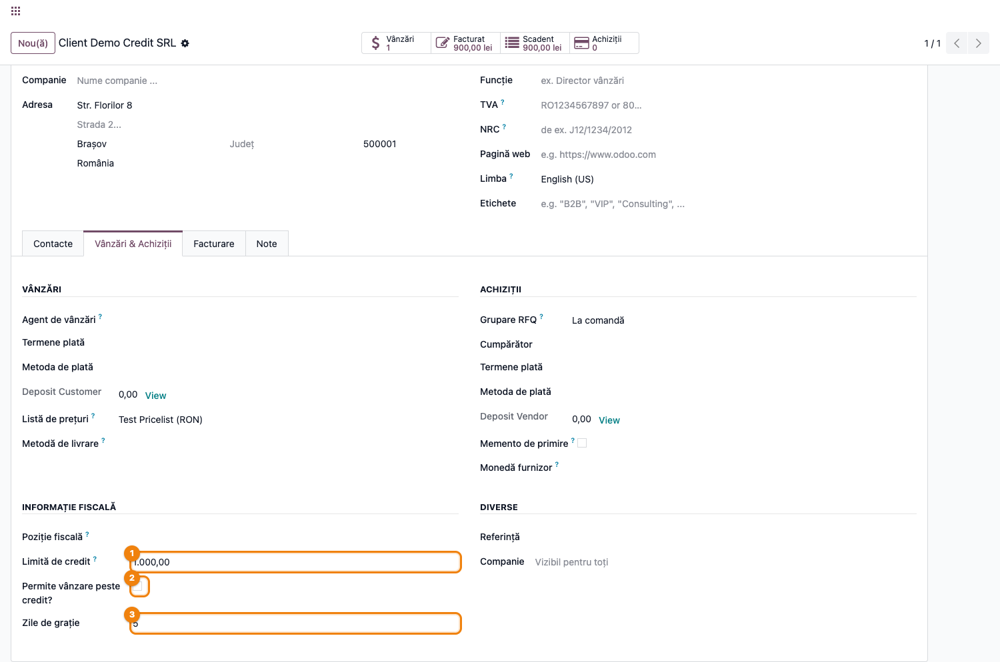
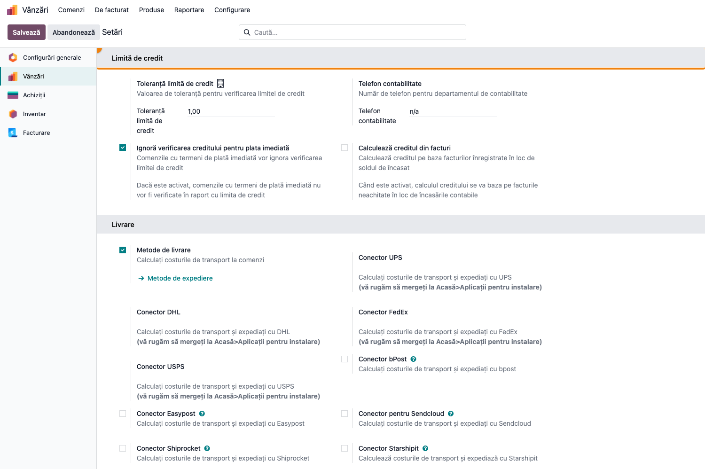
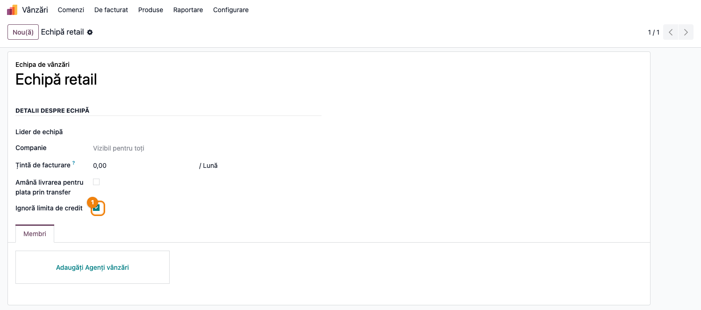
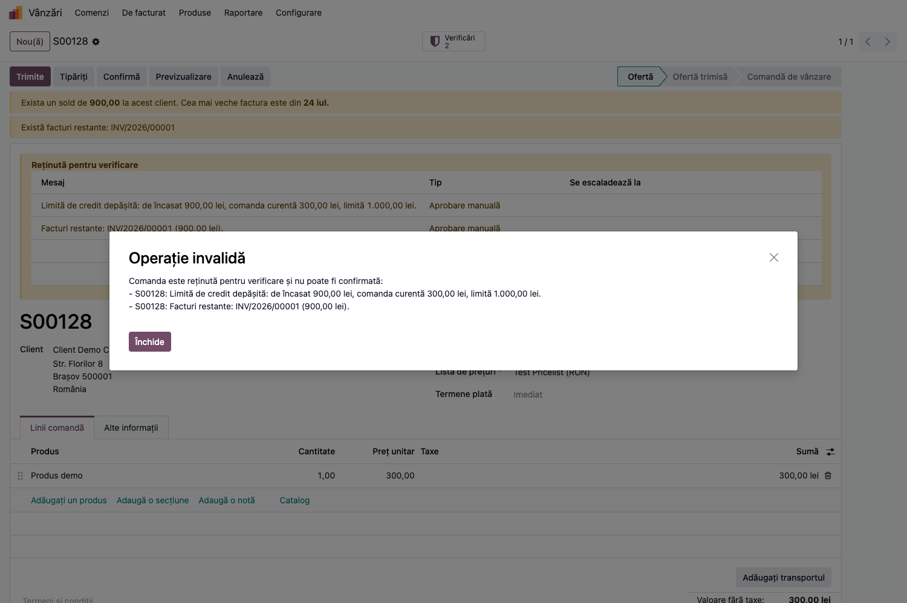
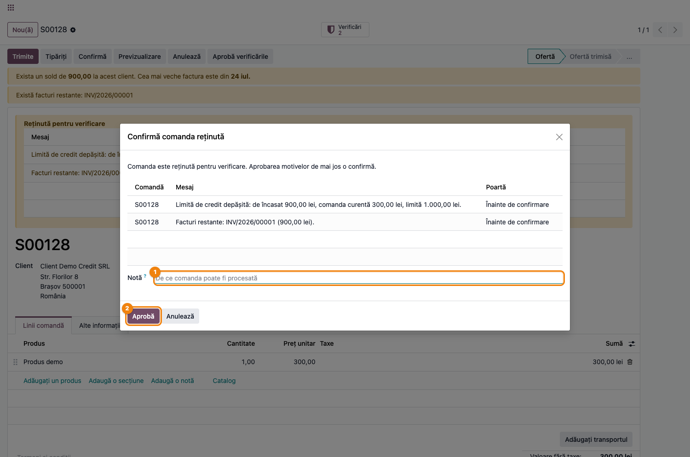
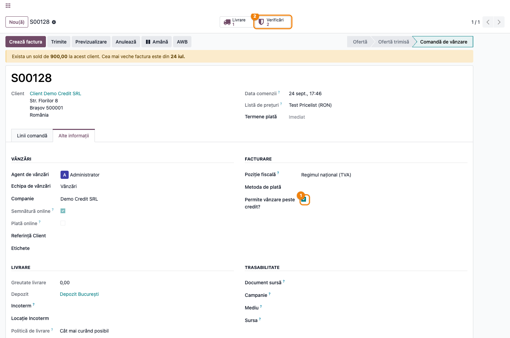

# Fișă Modul: Control limită de credit pentru parteneri

**Modul:** `terrabit_partner_credit_limit`
**Utilizator principal:** Contabil clienți, Manager vânzări, Operator comercial
**Prioritate:** 🟡 Medie (control de risc financiar, nu obligație legală)

---

## 1. Scop business

Această fișă descrie utilizarea modulului `terrabit_partner_credit_limit` pentru scenariul
**Control limită de credit pentru parteneri**. Modulul reține confirmarea comenzilor de vânzare
atunci când soldul de încasat al clientului (facturi neîncasate, opțional și cele restante) ar
depăși limita de credit stabilită pe partener, cu posibilitatea de derogare controlată prin roluri
și de excepții pe echipă de vânzări sau pe partener. Depășirea limitei și facturile restante sunt
**motive de verificare** pe comandă (modulul `deltatech_sale_order_review`, poarta *Înainte de
confirmare*): oferta rămâne ofertă, arată într-un banner de ce, iar utilizatorul cu drept de
aprobare confirmă printr-un wizard care înregistrează cine și de ce a aprobat. Consultantul folosește
documentul pentru reproducerea fluxului în baza demo.

## 2. Bază legală și context

Nu există o obligație legală specifică — este un control intern de gestiune a riscului de credit
comercial. Contextul operațional: firma acordă termene de plată clienților și dorește să limiteze
expunerea față de un client la o valoare maximă (limita de credit), eventual cu o marjă de toleranță
și cu o perioadă de grație (`clemency_days`) înainte ca o factură scadentă să fie considerată
restantă.

## 3. Utilizatori și roluri

Contabil clienți, Manager vânzări, Operator comercial (întocmește comenzi).

Roluri specifice introduse de modul:
- **Manage credit limits** (`group_credit_limit`) — poate modifica limita de credit, marcajul
  „Permite vânzare peste credit?" și zilele de grație de pe partener. **Nu** ocolește reținerea la
  confirmarea comenzii — dimpotrivă, cui are acest grup i se ascunde și butonul „Cere confirmare"
  (vezi Pasul 4).
- **Can approve sale order over credit limit** (`group_credit_limit_sale_order`) — grupul de
  aprobare al celor două reguli de verificare: singurul care poate aproba motivele „Limită de credit
  depășită" și „Facturi restante" (butonul **Confirmă** îi deschide wizardul de aprobare) și care
  poate bifa „Permite vânzare peste credit?" direct pe comandă. Aprobarea prin wizard pune bifa
  automat.

> Atenție la testare: un utilizator cu **doar** „Manage credit limits" (fără „Can approve…") rămâne
> reținut la confirmarea unei comenzi peste limită — primește mesajul cu lista motivelor — și nu
> vede nici butonul „Cere confirmare"; pentru deblocare are nevoie explicit de grupul „Can approve
> sale order over credit limit".

Roluri recomandate pentru testare:
- Administrator funcțional: instalează modulul și configurează parametrii globali și regulile.
- Operator comercial (fără grupurile de mai sus): creează comenzi, vede bannerul cu motivele și
  butonul „Cere confirmare"; la **Confirmă** primește refuzul cu lista motivelor.
- Contabil cu grupul „Manage credit limits": ajustează limita și zilele de grație.
- Manager cu grupul „Can approve sale order over credit limit": aprobă depășirile prin wizard.

## 4. Conturi și date implicate

Modulul nu introduce conturi noi — folosește soldul de încasat calculat de Odoo (`credit` pe
`res.partner`, alimentat din facturile de client `out_invoice`/`out_refund` postate și
neîncasate) sau, opțional, direct din facturi (`account.move`) dacă parametrul
`credit_limit_from_invoices` este activat.

Date minime pentru demo:
- companie cu localizare contabilă instalată și jurnal de vânzări funcțional;
- un partener de test cu `credit_limit` setat (ex. 1.000) și zile de grație (ex. 5);
- cel puțin o factură de client postată, neîncasată și **scadentă** pe acel partener (ex. 900 lei,
  termen 30 de zile, emisă acum două luni) — dă soldul de încasat și motivul „Facturi restante";
- o echipă de vânzări (`crm.team`) de test.

## 5. Configurare inițială

1. Instalați modulul `terrabit_partner_credit_limit` pe baza demo (depinde de `account_payment`,
   `sale_management`, `terrabit_partner_payable_receivable` și `deltatech_sale_order_review`).
2. Verificați elementele nou apărute: câmpurile de limită de credit pe formularul partenerului,
   blocul „Limită de credit" din **Vânzări → Configurare → Setări** și cele două reguli din
   **Vânzări → Configurare → Reguli de verificare comenzi**: **Limită de credit depășită** și
   **Facturi restante**, amândouă pe poarta *Înainte de confirmare*, tip *Aprobare manuală*, cu
   grupul de aprobare „Can approve sale order over credit limit". Comutatorul **Activ** le oprește
   fără să le șteargă.
3. Setați parametrii globali din Setări: toleranța, telefonul departamentului contabil și dacă
   termenele imediate sar peste verificare (implicit **activ** — vine setat `True` din
   `data/ir.config_parameter.xml` la instalare, deși câmpul din formular are default `False`).
4. Configurați `credit_limit` pe partenerul de test și, dacă e cazul, bifați „Ignoră limita de
   credit" pe echipa de vânzări folosită la testare.
5. Verificați că utilizatorul de test are/nu are grupurile „Manage credit limits" și „Can approve
   sale order over credit limit", după scenariul urmărit.

## 6. Flux de utilizare

### Pasul 1 — Setarea limitei de credit pe partener

Accesați **Contacte → deschideți partenerul → tab Vânzări & Achiziții**, secțiunea
**Informație fiscală**, și completați **Limită de credit**. Câmpurile **Permite vânzare peste
credit?** (`Allow Over Credit?`, ignoră permanent limita pentru acest partener) și **Zile de grație**
(`Clemency Days`, zile înainte ca o factură scadentă să conteze ca restantă) sunt editabile doar de
utilizatorii din grupul „Manage credit limits" — pentru ceilalți apar needitabile (`readonly`).



### Pasul 2 — Parametrii globali de verificare

Accesați **Vânzări → Configurare → Setări**, secțiunea **Limită de credit**: toleranța admisă
(`credit_limit.tolerance`, implicit 1), telefonul departamentului contabil afișat în mesajul de
eroare, opțiunea de a sări verificarea pentru termene de plată imediate
(`credit_limit.skip_term_immediate`) și opțiunea de a calcula soldul din facturi neplătite în loc
de soldul de încasat contabil (`credit_limit_from_invoices`).



> Dacă `credit_limit_from_invoices` este activat, un al doilea parametru,
> `credit_limit_check_supplier_invoices`, decide dacă se iau în calcul și facturile de furnizor
> (compensare) sau doar cele de client — acest al doilea parametru nu are câmp dedicat în Setări și
> se editează din **Tehnic → Parametri → Parametri de sistem**.

### Pasul 3 — Excepție pe echipă de vânzări

Accesați **Vânzări → Configurare → Echipe de vânzări → deschideți o echipă** și bifați
**Ignoră limita de credit** dacă acea echipă (ex. retail cu plată la livrare) nu trebuie supusă
verificării. Comenzile echipei nu primesc motive de credit.



### Pasul 4 — Oferta reținută înainte de confirmare

Creați o comandă de vânzare pentru partenerul de test, cu o valoare care, adunată la soldul curent,
depășește limita de credit plus toleranța (ex. sold 900 + comandă 300 > limită 1.000). La salvare,
comanda primește motivele de verificare și rămâne **ofertă**: bannerul **Reținută pentru verificare**
listează „Limită de credit depășită: de încasat 900,00 lei, comanda curentă 300,00 lei, limită
1.000,00 lei." și, dacă există facturi scadente peste zilele de grație, „Facturi restante:
INV/2026/00001 (900,00 lei)." Deasupra rămân și avertizările de sold ale modulului
`terrabit_partner_payable_receivable`. Smart button-ul **Verificări** deschide istoricul motivelor, iar
în lista de comenzi oferta are badge-ul **De verificat**.

Dacă utilizatorul **nu** are grupul „Can approve sale order over credit limit" și apasă **Confirmă**,
primește mesajul **„Comanda este reținută pentru verificare și nu poate fi confirmată"**, cu lista
motivelor, și oferta rămâne neatinsă. Fluxurile automate (importul din marketplace) nu confirmă nici
ele o astfel de ofertă — o lasă în coadă, cu motivele vizibile.

Utilizatorii care **nu** au grupul „Manage credit limits" văd în antet și butonul **Cere confirmare**
(`Req. confirm`) — vizibil doar pe ofertă/ofertă trimisă, când verificarea semnalează depășire sau
facturi restante — care deschide o activitate (`mail.activity`) adresată responsabilului echipei de
vânzări, cerându-i să aprobe depășirea.



### Pasul 5 — Aprobarea prin wizard

Pentru un utilizator din grupul „Can approve sale order over credit limit", **Confirmă** deschide
wizardul **Confirmă comanda reținută**, cu cele două motive, poarta la care opresc și un câmp
**Notă** (de ce comanda poate fi procesată). **Aprobă** aprobă motivele pe numele lui, notează în
chatter și confirmă comanda în același pas; **Anulează** lasă oferta neatinsă. Același wizard se
deschide și din **Aprobă verificările** (fără confirmare) sau, în lista de comenzi, din **Acțiuni →
Aprobă verificările** pe o selecție.

**Găsește pe ecran:** tabelul cu motivele — coloana **Mesaj** arată suma de încasat, valoarea
comenzii și limita, respectiv facturile restante și totalul lor.
**Verifică:** cifrele corespund cu soldul clientului (smart button-urile **Facturat** / **Scadent**
de pe partener) și cu decizia comercială luată (plata promisă, limita de mărit).
**Treci mai departe:** completați **Notă** cu justificarea și apăsați **Aprobă**.



### Pasul 6 — Derogarea înregistrată pe comandă

După aprobare, comanda este în starea **Comandă de vânzare**, iar în tabul **Alte informații** bifa
**Permite vânzare peste credit?** este pusă automat — derogarea pe care modulul o avea și înainte,
acum lăsată de wizard, nu de o mână. Smart button-ul **Verificări** arată cele două motive
**Aprobate**, cu numele aprobatorului, data și nota. Utilizatorii din grupul de aprobare pot bifa
„Permite vânzare peste credit?" și direct pe ofertă, înainte de confirmare, dacă vor să sară
wizardul; o comandă cu bifa pusă nu mai primește motive de credit.



### Note de monografie și raportare

Modulul nu generează note contabile proprii — se bazează pe soldul standard `res.partner.credit`
(sau pe facturile `account.move` neplătite, dacă `credit_limit_from_invoices` e activ) și doar
condiționează **confirmarea comenzii de vânzare**, fără a atinge înregistrările contabile ale
facturilor. Urma de audit este lista de motive de pe comandă (smart button **Verificări**), nota din
chatter la aprobare și câmpul „Permite vânzare peste credit?", care are urmărire (tracking).

## 7. Legături cu alte module / declarații

| Modul / proces | Rol în flux | Tip legătură |
|---|---|---|
| `account_payment` | soldul de încasat al partenerului, stare plăți | dependență (manifest) |
| `sale_management` | comanda de vânzare și fluxul de confirmare | dependență (manifest) |
| `terrabit_partner_payable_receivable` | avertizările de sold de pe formularul comenzii | dependență (manifest) |
| `deltatech_sale_order_review` | regulile **Limită de credit depășită** / **Facturi restante**, bannerul cu motivele, wizardul de aprobare, badge-ul **De verificat**, `_review_can_auto_confirm()` pentru fluxurile automate | dependență (manifest) |
| `crm_team` (`sales_team`) | excepția „Ignoră limita de credit" pe echipă | extindere |
| `mail` (`mail.activity`) | activitatea de solicitare de aprobare (**Cere confirmare**) | integrare |
| `deltatech_marketplace_sale` | importul lasă comanda ofertă, cu motivele vizibile, în loc să eșueze | integrare (când e instalat) |

> Notă: modulul suprascrie și `mail.activity._default_activity_type_for_model`, la nivel global
> (pentru toate modelele, nu doar `sale.order`) — dacă există un tip de activitate implicit definit
> pentru modelul respectiv, acela e folosit în locul celui standard.

Ce este automat: evaluarea celor două motive la crearea și modificarea comenzii, reținerea ofertei,
afișarea avertizărilor de sold, refuzul la **Confirmă** pentru cei fără grup, bifa „Permite vânzare
peste credit?" la aprobare, redeschiderea motivului dacă valoarea comenzii crește după aprobare,
rezolvarea motivului „Facturi restante" la încasarea facturii (la următoarea reevaluare),
precompletarea activității de aprobare către responsabilul echipei.
Ce rămâne manual: aprobarea prin wizard, decizia de a acorda grupurile de derogare, stabilirea
limitei de credit per partener și a parametrilor globali.

## 8. Verificări pentru consultant

- [ ] Modulul se instalează fără erori pe baza demo (dependențe: `account_payment`,
      `sale_management`, `terrabit_partner_payable_receivable`, `deltatech_sale_order_review`).
- [ ] În **Reguli de verificare comenzi** apar **Limită de credit depășită** și **Facturi restante**,
      active, pe poarta *Înainte de confirmare*, cu grupul de aprobare „Can approve sale order over
      credit limit".
- [ ] Câmpurile de limită de credit de pe partener sunt needitabile pentru un utilizator fără
      grupul „Manage credit limits" și editabile pentru unul cu acest grup.
- [ ] O comandă care depășește limita + toleranța primește motivul „Limită de credit depășită: …"
      cu soldul, valoarea comenzii și limita; rămâne ofertă, cu badge-ul **De verificat**.
- [ ] Un client cu o factură scadentă peste zilele de grație generează motivul „Facturi restante: …";
      încasarea facturii îl rezolvă la următoarea rulare a acțiunii planificate.
- [ ] **Confirmă** pentru un utilizator fără grupul de aprobare afișează „Comanda este reținută
      pentru verificare și nu poate fi confirmată" cu lista motivelor; pentru unul cu grup deschide
      wizardul.
- [ ] După **Aprobă** în wizard, comanda este confirmată, „Permite vânzare peste credit?" e bifat
      și motivele apar **Aprobate** în **Verificări**, cu aprobator și notă.
- [ ] Bifarea „Ignoră limita de credit" pe echipa de vânzări face ca comenzile echipei să nu
      primească motive de credit.
- [ ] Bifarea „Permite vânzare peste credit?" pe partener sau pe comandă (cu grupul potrivit)
      închide motivele și permite confirmarea.
- [ ] Butonul „Cere confirmare" apare doar pentru utilizatorii fără grupul „Manage credit limits",
      pe ofertă, când există motive, și deschide corect activitatea către responsabilul echipei.
- [ ] Parametrii din Setări (toleranță, telefon contabilitate, termen imediat, calcul din facturi)
      se salvează și influențează verificarea așa cum este descris.

## 9. Mesaje de eroare frecvente

| Mesaj / simptom | Cauză probabilă | Remediere |
|-----------------|-----------------|-----------|
| „Comanda este reținută pentru verificare și nu poate fi confirmată: - S…: Limită de credit depășită …" la **Confirmă** | Utilizatorul nu are grupul „Can approve sale order over credit limit" | Un utilizator din grup confirmă prin wizard; sau folosiți „Cere confirmare"; sau măriți limita / încasați facturile și așteptați reevaluarea |
| Motivul „Facturi restante: …" pe comandă | Există facturi scadente (peste zilele de grație) neîncasate, cu sold peste toleranță | Încasați/regularizați facturile restante (motivul se rezolvă singur) sau aprobați prin wizard |
| „Limita credit atinsă. De încasat: … Comanda curentă: … Limita credit: …" (EN: „Cannot confirm order…") | Confirmarea a ocolit butonul **Confirmă** (ex. cod sau acțiune care apelează direct `action_confirm`) pentru un utilizator fără grup — ultima gardă a modulului | Aceeași remediere ca la primul rând |
| Comanda importată din marketplace rămâne ofertă | Motivele de credit sunt deschise; importul nu confirmă comenzi reținute | Aprobați prin wizard sau rezolvați cauza; comanda se confirmă la următoarea rulare / manual |
| Câmpul „Limită de credit" apare needitabil pe partener | Utilizatorul curent nu are grupul „Manage credit limits" | Adăugați utilizatorul în grupul „Manage credit limits" |
| Câmpul „Permite vânzare peste credit?" nu apare pe comanda de vânzare | Utilizatorul nu are grupul „Can approve sale order over credit limit" | Adăugați utilizatorul în grupul respectiv sau folosiți butonul „Cere confirmare" |
| Un motiv aprobat a reapărut ca „Deschis" | Valoarea comenzii a crescut după aprobare | Aprobați din nou; comportamentul e intenționat |
| Verificarea nu ține cont de o comandă plătită cu cardul la confirmare | Parametrul `terrabit_partner_credit_limit.skip_only_card` limitează sărirea verificării doar la tranzacții altfel decât transfer bancar/ramburs | Verificați valoarea parametrului de sistem `terrabit_partner_credit_limit.skip_only_card` |

## 10. Capturi de ecran

Capturile (`readme/screenshots/`) sunt generate automat din `tests/test_screenshots.py` (mixinul
`ScreenshotCase` din `l10n_ro_doc_screenshots`, import defensiv), în limba română, pe compania RO:

1. `01_partner_credit_limit.png` — formularul partenerului cu limita de credit, „Permite vânzare
   peste credit?" și „Zile de grație".
2. `02_settings_credit_limit.png` — setările globale de limită de credit din
   Vânzări → Configurare → Setări.
3. `03_sale_team_ignore.png` — echipa de vânzări cu opțiunea „Ignoră limita de credit".
4. `04_sale_order_blocked.png` — oferta reținută: bannerul cu motivele „Limită de credit depășită" și
   „Facturi restante", și refuzul la **Confirmă** pentru un utilizator fără grupul de aprobare.
5. `05_wizard_confirmare_credit.png` — wizardul **Confirmă comanda reținută**, cu cele două motive,
   câmpul **Notă** și butonul **Aprobă**.
6. `06_sale_order_allow_overcredit.png` — comanda confirmată după aprobare, cu „Permite vânzare
   peste credit?" bifat și smart button-ul **Verificări**.

Regenerare (test Playwright, `tests/test_screenshots.py`; cere `l10n_ro` instalat pentru compania
RO):

```bash
./odoo/odoo-bin -c odoo.conf -d <db> -i l10n_ro -u terrabit_partner_credit_limit,l10n_ro_doc_screenshots \
    --test-tags=fise_screenshots --stop-after-init
```

## 11. Observații pentru manual

În manualul final, păstrați explicația orientată pe activitatea utilizatorului: modulul nu
generează note contabile, ci doar condiționează confirmarea comenzii de vânzare pe baza soldului
de încasat al clientului. Prezentați depășirea limitei și facturile restante ca **motive** pe
comandă, nu ca erori: operatorul vede în banner ce e de rezolvat, managerul aprobă printr-un wizard
care lasă urmă (cine, când, de ce), iar bifa „Permite vânzare peste credit?" este rezultatul
aprobării, nu gestul în sine. Insistați pe distincția dintre cele două grupuri de acces
(administrare limită vs. aprobare depășire pe comandă), pe rolul echipei de vânzări ca excepție
rapidă pentru canale fără risc de credit (plată la livrare/card) și pe faptul că o comandă editată
după aprobare (valoare mai mare) se redeschide singură.
