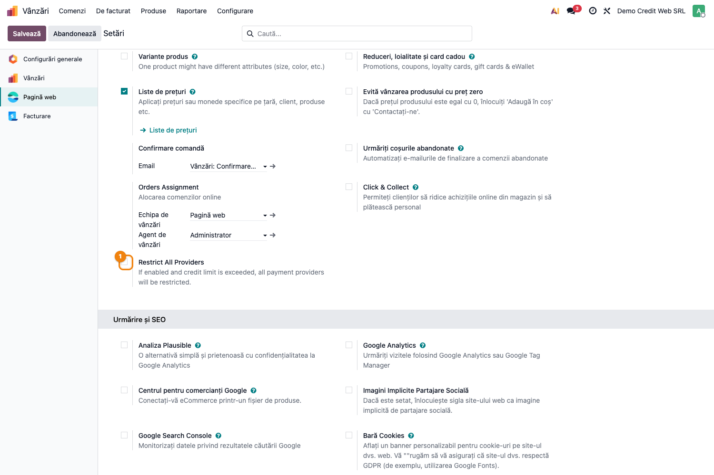
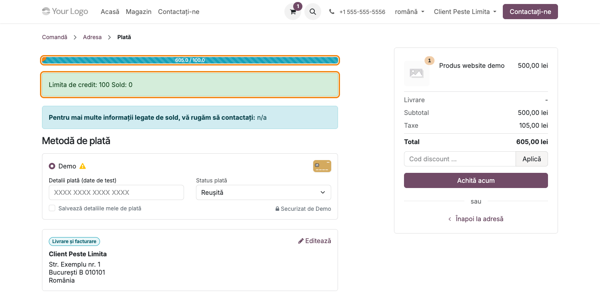
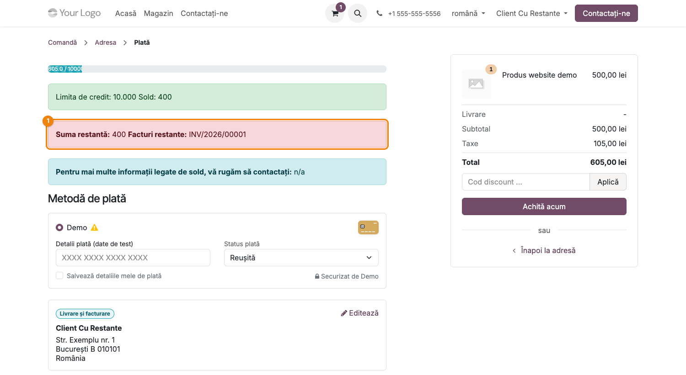
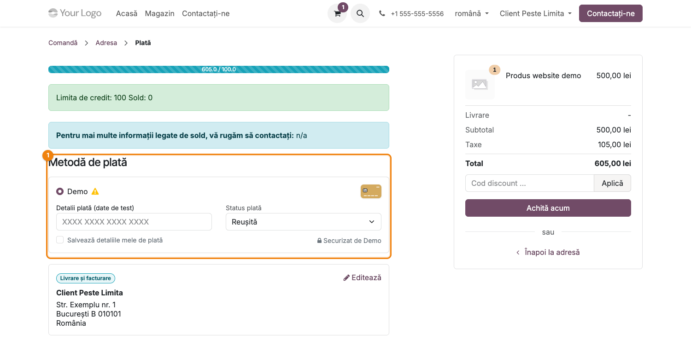

# Fișă Modul: Limita de credit la checkout-ul website

**Modul:** `terrabit_partner_credit_limit_website`
**Utilizator principal:** Manager vânzări online, Contabil clienți
**Prioritate:** 🟡 Medie (control de risc financiar pe canalul online, nu obligație legală)

---

## 1. Scop business

Această fișă descrie utilizarea modulului `terrabit_partner_credit_limit_website` pentru scenariul
**Limita de credit la checkout-ul website**. Modulul extinde controlul limitei de credit din
`terrabit_partner_credit_limit` la magazinul online: pe pagina de plată a comenzii, clientul
autentificat vede un rezumat vizual al soldului față de limita de credit, iar dacă limita e
depășită (sau există facturi restante), modulul **restricționează metodele de plată disponibile**
la checkout — nu blochează direct plasarea comenzii, ci elimină opțiunile „pe încredere" (transfer
bancar, plată la livrare), lăsând disponibile doar metodele de plată online care confirmă
încasarea imediat (card etc.), sau, opțional, elimină **toate** metodele, dacă administratorul
alege restricția totală.

## 2. Bază legală și context

Nu există o obligație legală specifică — este o extindere a controlului intern de risc de credit
(din `terrabit_partner_credit_limit`) către canalul de vânzare online, astfel încât politica de
credit să fie aplicată unitar indiferent dacă vânzarea vine din backend sau din website.

## 3. Utilizatori și roluri

Manager vânzări online, Contabil clienți (configurează parametrul global). Clientul final
(cumpărătorul autentificat pe website) este cel care vede efectul modulului la checkout.

Roluri recomandate pentru testare:
- Administrator funcțional: instalează modulul și configurează parametrul global din Setări.
- Client website (partener cu limită de credit depășită): parcurge checkout-ul și observă
  restricționarea metodelor de plată.

## 4. Conturi și date implicate

Modulul nu introduce conturi noi — reutilizează integral calculul de sold și limită din
`terrabit_partner_credit_limit` (`sale.order.check_limit()` / `can_skip_credit_limit()`).

Date minime pentru demo:
- un partener website cu `credit_limit` setat și sold curent care depășește limita (vezi fișa
  modulului de bază pentru cum se generează soldul);
- cel puțin doi furnizori de plată activi și publicați: unul online funcțional (ex. modulul de
  test `payment_demo`) și unul de tip transfer bancar (`custom_mode = wire_transfer`) sau plată la
  livrare (`code = on_delivery`), ca să se observe diferența de listă înainte/după restricție;
- comanda trebuie să aibă un termen de plată **diferit de „Immediate Payment"** — dacă parametrul
  `credit_limit.skip_term_immediate` e activ (implicit **da**), o comandă cu plată imediată sare
  complet verificarea limitei, inclusiv la checkout;
- un coș de cumpărături (comandă de vânzare din website) cu valoare care depășește limita.

## 5. Configurare inițială

1. Instalați modulul `terrabit_partner_credit_limit_website` pe baza demo (depinde de
   `terrabit_partner_credit_limit`, `website_sale` și `payment_custom`).
2. Configurați limita de credit pe partenerul de test (vezi fișa `terrabit_partner_credit_limit`).
3. Verificați parametrul nou din **Website → Configurare → Setări**, secțiunea de plăți:
   „Restrict All Providers".
4. Pregătiți cel puțin doi furnizori de plată publicați pe website: unul online funcțional și unul
   de tip transfer bancar (`custom_mode = wire_transfer`) sau plată la livrare (`code = on_delivery`).
5. Autentificați-vă pe website ca partenerul de test și adăugați produse în coș peste limita de
   credit disponibilă, cu un termen de plată diferit de „Immediate Payment" pe comandă.

## 6. Flux de utilizare

### Pasul 1 — Parametrul global de restricție

Accesați **Website → Configurare → Setări**, secțiunea de plăți, și bifați **Restrict All
Providers** dacă doriți ca, la depășirea limitei de credit, **toate** metodele de plată să fie
eliminate (client blocat complet la checkout până se rezolvă soldul). Lăsată nebifată (implicit),
modulul elimină doar transferul bancar și plata la livrare, păstrând disponibile metodele de plată
online.



### Pasul 2 — Rezumatul soldului pe pagina de plată

Autentificat ca partenerul de test, adăugați produse în coș și mergeți la pagina de plată
(`/shop/payment`). Modulul afișează o bară de progres (sold curent față de limita de credit) și un
rezumat text cu „Credit limit" și „Sold", calculate din același `check_limit()` folosit la
confirmarea comenzilor din backend.



### Pasul 3 — Alerta de facturi restante

Dacă partenerul are facturi scadente neîncasate (peste zilele de grație configurate în modulul de
bază), pagina de plată afișează o alertă roșie cu suma restantă și lista facturilor, urmată de un
mesaj cu telefonul departamentului de contabilitate pentru clarificări.



### Pasul 4 — Restricționarea metodelor de plată

Când soldul plus valoarea comenzii depășesc limita de credit (sau există facturi restante), lista
de metode de plată disponibile la checkout se restrânge: transferul bancar și/sau plata la livrare
(metodele „pe încredere", fără confirmare imediată a încasării) **dispar**, rămânând doar metodele
de plată online — cu excepția cazului în care „Restrict All Providers" e activat, situație în care
**nicio** metodă de plată nu mai este disponibilă (nici cele online).



### Note de monografie și raportare

Modulul nu generează note contabile proprii și nu introduce câmpuri noi de sold — afișează pe
website și aplică la alegerea metodei de plată același rezultat calculat de
`sale.order.check_limit()` din `terrabit_partner_credit_limit`.

## 7. Legături cu alte module / declarații

| Modul / proces | Rol în flux | Tip legătură |
|---|---|---|
| `terrabit_partner_credit_limit` | calculul soldului, limitei și facturilor restante (`check_limit`, `can_skip_credit_limit`) | dependență (manifest) |
| `website_sale` | pagina de plată (`website_sale.payment`) unde se afișează rezumatul de credit | dependență (manifest) |
| `payment_custom` | furnizorii de plată cu `custom_mode` (transfer bancar) — exact cei **eliminați** la depășirea limitei | dependență (manifest) |

Ce este automat: afișarea rezumatului de sold/limită și a alertei de facturi restante pe pagina de
plată, eliminarea din lista de furnizori de plată compatibili a metodelor „pe încredere" (transfer
bancar/ramburs) la checkout.
Ce rămâne manual: decizia „Restrict All Providers" (restricție parțială vs. totală), configurarea
limitei de credit per partener și publicarea a cel puțin unei metode de plată online funcționale,
altfel un client peste limită rămâne fără nicio opțiune de plată chiar și cu restricția parțială.

## 8. Verificări pentru consultant

- [ ] Modulul se instalează fără erori pe baza demo (dependențe: `terrabit_partner_credit_limit`,
      `website_sale`, `payment_custom`).
- [ ] Parametrul „Restrict All Providers" din Website → Configurare → Setări se salvează corect.
- [ ] Pe pagina de plată, bara de progres și rezumatul „Credit limit / Sold" apar doar când
      partenerul are o limită de credit setată.
- [ ] Alerta de facturi restante apare doar când există facturi scadente neîncasate peste zilele de
      grație.
- [ ] Cu „Restrict All Providers" dezactivat, la depășirea limitei dispar transferul bancar și/sau
      plata la livrare, rămânând disponibile metodele de plată online.
- [ ] Cu „Restrict All Providers" activat, la depășirea limitei nu mai apare nicio metodă de plată.
- [ ] Un partener care nu depășește limita vede lista completă de metode de plată, neafectată.
- [ ] O comandă cu termen de plată „Immediate Payment" NU este supusă verificării (comportament
      implicit, din `credit_limit.skip_term_immediate`) — testați cu alt termen de plată.

## 9. Mesaje de eroare frecvente

| Mesaj / simptom | Cauză probabilă | Remediere |
|-----------------|-----------------|-----------|
| Pe pagina de plată nu apare nicio metodă de plată | Limita de credit e depășită și „Restrict All Providers" e activat, **sau** nu există niciun furnizor de plată online publicat (au rămas doar transfer bancar/ramburs, tocmai eliminate) | Dezactivați „Restrict All Providers" sau publicați un furnizor de plată online funcțional |
| Bara de progres/rezumatul de credit nu apare deloc pe pagina de plată | Partenerul nu are `credit_limit` setat (câmp gol/zero) | Setați limita de credit pe partener din backend (vezi fișa `terrabit_partner_credit_limit`) |
| Clientul e restricționat deși limita pare respectată | Verificarea include și facturile restante, nu doar soldul curent — o factură scadentă poate declanșa restricția chiar sub limită | Verificați secțiunea „Facturi restante" a rezumatului și modulul de bază pentru zilele de grație configurate |
| Restricția nu se aplică deloc pentru un partener peste limită | Comanda/echipa de vânzări are activă o excepție (`allow_overcredit`, `over_credit` sau echipă cu „Ignore credit limits") din modulul de bază, **sau** comanda are termenul de plată „Immediate Payment" (sărit implicit din `credit_limit.skip_term_immediate`) | Verificați excepțiile din `terrabit_partner_credit_limit` aplicabile comenzii/partenerului și termenul de plată al comenzii |

## 10. Capturi de ecran

Capturile (`readme/screenshots/`) sunt generate din `tests/test_screenshots.py`, în limba română:

1. `01_settings_restrict_all.png` — setarea „Restrict All Providers" din Website → Configurare →
   Setări.
2. `02_checkout_progress.png` — bara de progres și rezumatul soldului pe pagina de plată.
3. `03_checkout_overdue.png` — alerta de facturi restante și telefonul de contact al contabilității.
4. `04_checkout_restricted_providers.png` — lista de metode de plată restricționată la checkout.

Regenerare (`payment_demo` e necesar doar pentru a avea un furnizor de plată online funcțional în
demo — nu e dependență a modulului):

```bash
./odoo/odoo-bin -c odoo.conf -d <db> -i payment_demo \
    -u terrabit_partner_credit_limit_website,l10n_ro_doc_screenshots \
    --test-tags=fise_screenshots --stop-after-init
```

## 11. Observații pentru manual

În manualul final, subliniați diferența față de modulul de bază: aici nu se blochează plasarea
comenzii, ci se **elimină metodele de plată „pe încredere"** (transfer bancar, ramburs) atunci când
clientul depășește limita, lăsând doar plata online (care confirmă încasarea imediat); clientul
vede proactiv motivul (sold, limită, facturi restante) direct pe pagina de plată, înainte de a
alege o metodă. Atrageți atenția și asupra parametrului `credit_limit.skip_term_immediate`
(implicit activ): o comandă cu termen de plată „Immediate Payment" nu e supusă deloc verificării.
